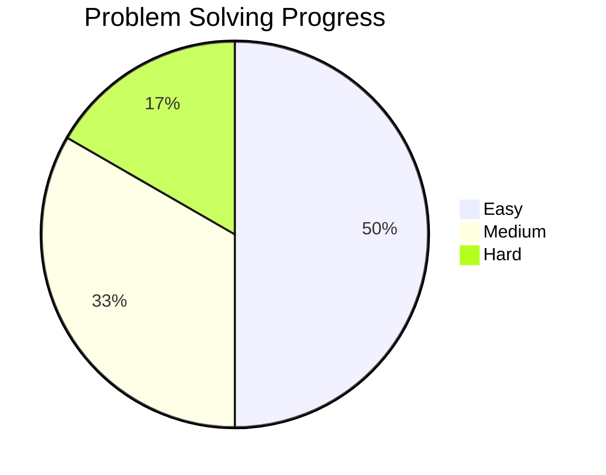

# Data Structures and Algorithms Practice

## 📚 Problem Categories

<details>
<summary>Arrays & Strings</summary>

| Problem | Difficulty | Solution | Topics |
|---------|------------|----------|---------|
| [Two Sum](./Arrays/two-sum.js) | Easy | ✅ | `Array`, `Hash Table` |
<!-- Add more problems in this category -->

</details>

<details>
<summary>Linked Lists</summary>

| Problem | Difficulty | Solution | Topics |
|---------|------------|----------|---------|
| [Reverse Linked List](./LinkedList/reverse.js) | Easy | ✅ | `Linked List`, `Recursion` |
<!-- Add more problems in this category -->

</details>

<details>
<summary>Trees & Graphs</summary>

| Problem | Difficulty | Solution | Topics |
|---------|------------|----------|---------|
| [Binary Tree Traversal](./Trees/traversal.js) | Medium | ✅ | `Tree`, `DFS`, `BFS` |
<!-- Add more problems in this category -->

</details>

## 🎯 Progress Tracking



## 📊 Topic Coverage

| Topic | Problems Solved | Mastery Level |
|-------|----------------|---------------|
| Arrays | 15 | ⭐⭐⭐ |
| Trees | 10 | ⭐⭐ |
| DP | 8 | ⭐⭐⭐⭐ |
<!-- Add more topics -->

### 📊 Topic Coverage Chart (counts — not percentages)

Update the numbers below to reflect "Problems Solved" per topic. The ASCII chart always renders in plain Markdown; the Mermaid bar chart is optional and only works if your renderer supports Mermaid bar charts.

Current counts:
- Arrays: 15
- Trees: 10
- DP: 8

ASCII bar chart (1 block = 1 problem)
```
Arrays | 15 ███████████████
Trees  | 10 ██████████
DP     | 8  ████████
```

Optional Mermaid bar chart (may not render on all platforms)
```mermaid
%%{init: {'theme': 'default'}}%%
bar
  title Problems per Topic (counts)
  "Arrays": 15
  "Trees": 10
  "DP": 8
```

How to update:
1. Edit the three numeric values above (Arrays / Trees / DP).
2. Keep the ASCII bars visually consistent — add/remove '█' blocks to match the count (1 block = 1 problem).
3. Also update the "Topic Coverage" table above so numbers stay in sync.

## 🗂️ Directory Structure
```
DSA problems/
├── Arrays/
├── LinkedList/
├── Trees/
├── DP/
└── README.md
```

## 📈 Learning Roadmap

1. **Foundation** 
   - [x] Basic Array Operations
   - [x] String Manipulation
   - [ ] Basic Sorting

2. **Intermediate**
   - [ ] Tree Traversals
   - [ ] Graph Algorithms
   - [x] Dynamic Programming Basics

3. **Advanced**
   - [ ] Advanced Graph Algorithms
   - [ ] System Design
   - [ ] Complex DP

## 🔍 Quick Navigation

- [Arrays & Strings](#arrays--strings)
- [Linked Lists](#linked-lists)
- [Trees & Graphs](#trees--graphs)
- [Dynamic Programming](#dynamic-programming)

## 🚀 How to Use

1. Problems are organized by data structure/algorithm type
2. Each category is collapsible for better navigation
3. Use the progress tracking to monitor your learning
4. Follow the learning roadmap for structured progress

## 📝 Notes

- ✅ = Completed
- 🔄 = In Progress
- ⭐ = Difficulty Level
- 📌 = Important Problem
